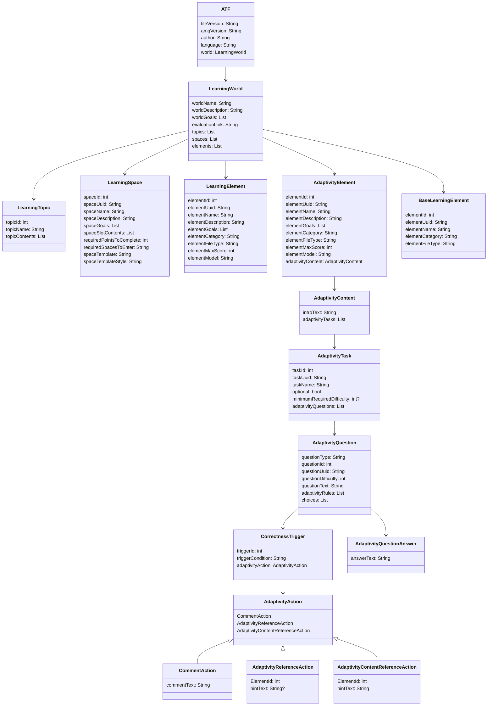

# AdLer Transfer File (ATF)

Das Dateiformat dient zum Austausch von Daten zwischen den 3 AdLer-Komponenten AMG, Backend und 3D-Frontend.

## Visualisierung

## Datenstruktur

Die Struktur der gesamten Lernwelt sowie übergeordneten Metadaten wird über ein einziges JSON-Objekt abgebildet. Zum jetzigen Zeitpunkt befindet sich auf dem Root-Level dieses Objekts rein die Versionsnummer des Files sowie ein Objekt, welches die Lernwelt mit all ihren Inhalten beschreibt.

## Versionierung

Um sicherzustellen, dass die Komponenten ordnungsgemäß kommunizieren können, wird das ATF-File mit einer Versionsnummer versehen. Diese Versionsnummer wird auf dem Root-Level des JSON-Objekts gespeichert. Die Komponenten können nun überprüfen, ob sie mit der Version des Files umgehen können.

## Vorgeschichte

Das ATF-File wurde im Laufe der Entwicklung des AdLer-Systems stetig weiterentwickelt. Allerdings wurden diese Entwicklungen nicht oder nicht ausreichend dokumentiert. Deshalb startet das AFT-Format mit der Versionsnummer 0.3. Alle vorherigen Änderungen sind nicht einzusehen und nicht im Changelog vorhanden.

## Konventionen

Die Konventionen, die in diesem Dokument verwendet werden, richten sich grundlegend nach der [JSON-Spec](https://www.json.org/json-de.html).

### Normalisierung der Daten

Zusätzlich dazu wird auf eine Normalisierung der Datenstruktur geachtet. Das bedeutet, dass die Datenstruktur immer gleich ist, unabhängig von der Anzahl der Elemente. Das führt dazu, Elemente, die öfters in verschiedenen Objekten vorkommen, in eigene Objekte auszulagern und per ID zu referenzieren.

### Singular vs. Plural

Die Namen von Schlüsseln, die einen einzigen Wert beinhalten, sollen immer im Singular geschrieben werden. Die Namen von Schlüsseln, die mehrere Werte (Arrays) beinhalten, sollen immer im Plural geschrieben werden.

## Beschreibung der einzelnen Felder

### Beschreibung der Felder des Adaptivity Modules

| Schlüssel             | Datentyp | Erlaubte Einträge                                   | Funktion                                                                                                                                                                                                    | benötigt?               |
| --------------------- | -------- |-----------------------------------------------------|-------------------------------------------------------------------------------------------------------------------------------------------------------------------------------------------------------------|-------------------------|
| `$type`               | string   |                                                     | Typ des Moduls/Elements                                                                                                                                                                                     | Ja                                                                                                                                                                                                  |
| `elementId`           | int      |                                                     | Eindeutige ID des Adaptivity-Moduls                                                                                                                                                                         | Ja                       |
| `elementUUID`         | string   |                                                     | Eindeutige UUID des Adaptivity-Moduls                                                                                                                                                                       | Ja                                  |
| `elementName`         | string   |                                                     | Name des Adaptivity-Moduls                                                                                                                                                                                  | Ja                                    |
| `elementDescription`  | string   |                                                     | Beschreibung des Adaptivity-Moduls                                                                                                                                                                          | Nein                                  |
| `elementGoals`        | [string] |                                                     | Ziele des Adaptivity-Moduls                                                                                                                                                                                 | Nein                                  |
| `elementCategory`     | string   |                                                     | Kategorie des Moduls (z.B. "adaptivity")                                                                                                                                                                    | Ja                                    |
| `elementFileType`     | string   |                                                     | Art des Dateityps des Adaptivity-Moduls (könnte optional sein, da nur ein Adaptivity-Modul existiert)                                                                                                       | Ja                                       |
| `elementMaxScore`     | integer  |                                                     | Maximale Punktzahl, die für das Modul vergeben werden kann (noch zu klären)                                                                                                                                 | Ja                                                                                                    |
| `elementModel`        | string   | [Erlaubte Modell Namen](Model-Bezeichnungen-ATF.md) | Modell zur Anzeige des Moduls                                                                                                                                                                               | Ja                                                                                                    |
| `adaptivityContent`   | object   |                                                     | Inhalte des Adaptivity-Moduls                                                                                                                                                                               | Ja                                                                                                    |
| `adaptivityTasks`     | [object] |                                                     | Liste der Aufgaben innerhalb des Adaptivity-Moduls                                                                                                                                                          | Ja                                                                                                    |
| `adaptivityQuestions` | [object] |                                                     | Fragen, die mit den Aufgaben verbunden sind                                                                                                                                                                 | Ja                                                                                                    |
| `adaptivityRules`     | [object] |                                                     | Regeln für die Adaptivität basierend auf der Richtigkeit der Antwort                                                                                                                                        | Ja                                                                                                    |
| `choices`             | [object] |                                                     | Auswahlmöglichkeiten für die Fragen (Ordnung im Array ist wichtig zur Identifizierung der Antworten; Mischung/Neuordnung sollte im Frontend erfolgen, da keine IDs für die Auswahlmöglichkeiten existieren) | Ja                                                                                                    |

### Beschreibung der Felder für externe Lernelemente

| Schlüssel         | Datentyp | Funktion                                 | benötigt? |  |
| ----------------- | -------- |------------------------------------------| --------- |--|
| `$type`           | string   | Typ des Lernelements                     | Ja        |  |
| `elementId`       | int      | Eindeutige ID des Lernelements           | Ja        |
| `elementUUID`     | string   | Eindeutige UUID des Lernelements         | Ja        |
| `elementName`     | string   | Name des externen Lernelements           | Ja        |
| `elementCategory` | string   | Kategorie des Lernelements (z.B. "text") | Ja        |
| `elementFileType` | string   | Art des Dateityps des Lernelements       | Ja        |

### Beschreibung der Felder der Welt

| Schlüssel            | Datentyp | Funktion                                                                                     | benötigt? |
| -------------------- | -------- | -------------------------------------------------------------------------------------------- | --------- |
| lmsElementIdentifier | objekt   | Objekt, welches durch Angabe von Typ und Wert ein Element im LMS eindeutig bezeichnen kann    | Ja        |
| worldDescription     | string   | Beschreibung der Lernwelt, welche dem Nutzer angezeigt wird                                  | Nein      |
| worldGoals           | [string] | Einzelne Lernziele der Welt                                                                  | Nein      |
| worldName            | string   | Name der Welt                                                                                | Ja        |
| spaces               | [object] | Array aus Spaces, die in der Welt vorhanden sind                                             | Ja        |
| evaluationLink       | string   | Link für einen Evaluations-Link, sollte dieser in der Engine angezeigt werden                | Nein      |

### Beschreibung der Felder des Topics

| Schlüssel     | Datentyp | Funktion                                                         | benötigt? |
| ------------- | -------- | ---------------------------------------------------------------- | --------- |
| topicId       | int      | ID des Topics                                                    | Ja        |
| topicName     | string   | Name des Topics                                                  | Ja        |
| topicContents | [int]    | Array aus den IDs der Spaces, die in dem Topic enthalten sind    | Ja        |

### Beschreibung der Felder der Spaces

| Schlüssel                | Datentyp                   | Erlaubte Einträge                                                           | Funktion                                                                                                           | benötigt? |
| ------------------------ |----------------------------|-----------------------------------------------------------------------------|--------------------------------------------------------------------------------------------------------------------| --------- |
| lmsElementIdentifier     | objekt                     |                                                                             | Objekt, welches durch Angabe von Typ und Wert ein Element im LMS eindeutig bezeichnen kann                         | Ja                                                                                                               |
| spaceContents            | [int]                      |                                                                             | (deprecated ab Version 0.4) IDs der Lernelemente, die sich in dem Raum befinden                                    | Ja                                                                                         |
| includedPoints           | int                        |                                                                             | Wie viele Punkte ein Raum maximal abwerfen kann                                                                    | Ja                                                                                         |
| requiredPointsToComplete | integer                    |                                                                             | Wie viele Punkte in einem Raum angesammelt werden müssen, damit er als abgeschlossen gilt                          | Ja                                                                                         |
| requiredSpacesToEnter    | string (boolesche Algebra) |                                                                             | Spaces mit UND und ODER verknüpft, die die Bedingung zum Öffnen des Space bilden (siehe Beschreibung unten)        | Ja                                                                                         |
| spaceName                | string                     |                                                                             | Name des Lernraumes                                                                                                | Ja                                                                                                          |
| spaceDescription         | string                     |                                                                             | Beschreibung des Spaces, welche dem Nutzer angezeigt wird                                                          | Nein                                                                                                        |
| spaceGoals               | [string]                   |                                                                             | Einzelne Lernziele des Spaces                                                                                      | Nein                                                                                                        |
| spaceSlotContents        | [int]                      |                                                                             | Die Lernelemente, die sich in dem Raum befinden mit deren Slot (repräsentiert durch den Array-Index (null = leer)) | Ja                                                                                                          |
| spaceTemplate            | string                     | "L_32X31_10L", "T_40X32_13L", "R_20X20_6L", "R_20X30_8L", "D_40X37_15L", "" | Das Template, welches für das Modell des Raumes genutzt wird                                                       | Ja                                                                                                                 |
| spaceTemplateStyle       | string                     |                                                                             | Der Style des Templates, welcher genutzt werden soll                                                               | Ja                                                                                                                 |

### Beschreibung der Felder des Elements

| Schlüssel            | Datentyp | Erlaubte Einträge                                   | Funktion                                                                                   | benötigt? |
| -------------------- | -------- |-----------------------------------------------------|--------------------------------------------------------------------------------------------| --------- |
| lmsElementIdentifier | objekt   |                                                     | Objekt, welches durch Angabe von Typ und Wert ein Element im LMS eindeutig bezeichnen kann | Ja                                                                                      |
| elementId            | int      |                                                     | ID des Lernelements                                                                        | Ja                                                                                         |
| elementDescription   | string   |                                                     | Beschreibung des Lernelements                                                              | Nein                                                                                       |
| elementGoals         | [string] |                                                     | Ziele des Lernelements                                                                     | Nein                                                                                       |
| elementCategory      | string   |                                                     | Art des Lernelements (Bild, Text, H5P, etc.)                                               | Ja                                                                                         |
| elementFileType      | string   |                                                     | Genauer Content des Lernelements (im Falle Bild: Jpeg, PNG, ...)                           | Ja                                                                                         |
| elementMaxScore      | integer  |                                                     | Wie viele Punkte das Element maximal gibt, wenn es abgeschlossen ist                       | Ja                                                                                         |
| elementName          | string   |                                                     | Name des Elements                                                                          | Ja                                                                                         |
| elementModel         | string   | [Erlaubte Modell Namen](Model-Bezeichnungen-ATF.md) | Modell, welches zur Anzeige des Elements genutzt werden soll                               | Ja                                                                                         |
| spaceStory           | objekt   |                                                     | Stellt die Story für einen Lernraum bereit.                                                | Nein                                                                                       |

### Beschreibung der Felder des Root Elements

| Schlüssel   | Datentyp     | Funktion                                 | benötigt? |
| ----------- | ------------ | ---------------------------------------- | --------- |
| fileVersion | string       | Gibt die Version des ATF-Files an        | Ja        |
| amgVersion  | string       | Gibt die Version des AMG-Tools an        | Nein      |
| author      | string       | Autor der Lernwelt                       | Nein      |
| language    | ["de", "en"] | Sprache der Lernwelt in Country-Code-Format | Nein      |
| world       | objekt       | Beinhaltet alle Daten der Lernwelt       | Ja        |

### Beschreibung der Felder des Space

| Schlüssel    | Datentyp | Erlaubte Einträge                                   | Funktion                                             | benötigt? |
| ------------ | -------- |-----------------------------------------------------|------------------------------------------------------| --------- |
| intoStory    | objekt   |                                                     | Story, die beim Betreten des Raumes abgespielt wird  | Nein                                               |
| outroStory   | objekt   |                                                     | Story, die beim Verlassen des Raumes abgespielt wird | Nein                                                |
| storyTexts   | [string] |                                                     | Texte, aus welchen die Story besteht                 | Nein                                                 |
| elementModel | string   | [Erlaubte Modell Namen](Model-Bezeichnungen-ATF.md) | Das Modell, welches für das Lernelement genutzt wird | Ja                                                   |

## JSON Schema

Das File-Format ist mittels JSON-Schema definiert. Neben einer eindeutigen Dokumentation aller Typen, Elemente, Schlüssel und Strukturen kann damit auch eine Validierung der Datei ausgeführt werden. Ein JSON-Schema zu jeder Version ist in den entsprechenden Ordnern zu finden.

## Bedingungen für Lernräume mittels Aussagenlogik erstellen

Die Bedingungen zwischen Lernräumen gehen über reine Mindestpunkte hinaus. Aus diesem Grund wurde eine Aussagenlogik implementiert, welche es ermöglicht, die Bedingungen zwischen Lernräumen zu definieren. Dabei werden Räume mittels UND (^) und ODER (v) verknüpft. Komplexere Zusammenhänge können mittels Klammern realisiert werden. Eine Negation oder ähnliches ist nicht möglich, jedoch gilt die allgemeine Regel "Und vor Oder". Dabei ist zu beachten, dass ein Raum ab dann als abgeschlossen gilt, wenn er seine benötigten Punkte zur Freischaltung erreicht hat.

Eine beispielhafte Verknüpfung für einen Lernraum ist: `"requiredSpacesToEnter": "(5)v((7)^(4))"`

## Mögliche Werte (Bitte ergänzen)

### elementCategory

- "image", "text", "h5p" oder "video"

### elementFileType

- "jpeg", "png", "mp4", "h5p" weitere bitte von AMG ergänzen

### Raum-Templates und deren Datentypen

Nachfolgend sind die Templates aufgelistet, die für die Darstellung der Räume genutzt werden können. In den Spalten "Template" befinden sich die möglichen Strings für das Feld **spaceTemplate**. In den Spalten "Style" befinden sich die möglichen Strings für das Feld **spaceTemplateStyle**.

| Template    | Style              | Beschreibung                        |
| ----------- | ------------------ | ----------------------------------- |
| "Template1" | "Template1Style1"  |                                     |
|             | "Template1Style2"  |                                     |
|             | "Template1Style3"  |                                     |

### Modelle für Lernelemente

| Lernelement Typ | Modell        | Beschreibung |
| --------------- | ------------- | ------------ |
| "image"         | "imageModel1" |              |
| "text"          | "textModel1"  |              |
| "h5p"           | "h5pModel1"   |              |
| "video"         | "videoModel1" |              |
| "pdf"           | "pdfModel1"   |              |

## Changelog

## Version 0.5

### Changes to the World

- **evaluationLink**: Ein optionales Feld für einen Evaluations-Link für eine Lernwelt wurde hinzugefügt.

### Version 0.4

In Version 0.4 werden Templates für Lernräume sowie für Lernelemente hinzugefügt.

#### Änderungen am Space

- **spaceTemplate**: Das Template, welches für das Modell des Raumes genutzt wird.
- **spaceTemplateStyle**: Der Style des Templates, welcher genutzt werden soll.
- **spaceSlotContents**: Die Lernelemente, die sich in dem Raum befinden mit deren Slot (repräsentiert durch den Array-Index (null = leer)).

#### Änderungen am Element

- **elementModel**: Das Modell, welches für das Lernelement genutzt wird.

# Diskussionspunkte

- **Identifier für verschiedene Elemente auf dem LMS**: Elemente können auf dem LMS leider nicht immer mit einer ID versehen werden. Daher MUSS es mehrere Möglichkeiten geben, diese zu identifizieren. Bisher werden Elemente im LMS (Lernwelt, Lernelement) mittels dem Namen identifiziert. Da es in Zukunft aber möglich sein soll, diese Elemente mittels einer ID zu identifizieren, wurde sich bis jetzt dazu entschieden, ein Objekt aus Identifikationsmethode und dem jeweiligen Wert zu übergeben.
- **worldGoals**: Im Gegensatz zu bisher ist hier nun ein Array aus Strings. Das hat den Grund, dass es eventuell sinnvoller ist, die Lernziele als Liste zu formatieren und diese dementsprechend nutzerfreundlicher anzuzeigen. Gleiches gilt für die Spaces und Elemente.
- **fileVersion**: Soll dazu dienen, den richtigen Parser zu wählen.
- **amgVersion**: Soll primär zum Debugging dienen, um zu identifizieren, mit welchem Generator das File erstellt wurde, sollte etwas schiefgegangen sein.
- **elementPoints**: Ursprünglich war hier eine Liste an "Belohnungen", welche der Nutzer für das Abschließen des Elements bekommt. Neben Punkten hätten dies beispielsweise auch Badges oder Errungenschaften sein können. Jedoch wurde sich dazu entschieden, Errungenschaften und Badges vorerst zu ignorieren und diese, wenn immer noch gefordert, an anderer Stelle zu implementieren.
- **url**: Wurde entfernt, da der Content des Lernelements ohnehin über die API erfragt wird, da nicht in jedem Fall der Content hier angegeben werden kann.
- **elementFileType**: Gibt an, wie der Inhalt des Elements behandelt werden muss, sobald er von dem 3D-Frontend geladen wurde.
- **learningSpaceParentId**: Wurde entfernt, da es eine redundante Information ist und nicht normalisiert ist.
- **Autor und Language**: Da es im AMG ohnehin eingegeben wird, schlage ich vor, das direkt auch mitzuliefern. Es wurde sich auch überlegt, den Moodle-Autor dafür zu nutzen, allerdings kann es auch ein anderer sein, der das Backup auf Moodle hochlädt.
- **Namen für alle Elemente**: Es wurden Namen für alle Elemente hinzugefügt (World, Space, Element).
- **"Learning" als Prefix herausgestrichen**: Der Übersicht halber wurde das Wort "Learning" wegrationalisiert.

# Breaking changes zu der undokumentierten Version

## Root Level

- `fileVersion` wird zwingend benötigt.
- `learningWorld` heißt jetzt `world`.

## World

- `idNumber` existiert nicht mehr.
- `identifier` heißt jetzt `lmsElementIdentifier` und hat andere Werte.
- `worldName` ist zwingend notwendig.
- `description` und `goals` heißen jetzt `worldDescription` und `worldGoals`.
- `worldGoals` ist ein Array aus Strings.
- `topics` existiert nicht mehr.
- `learningWorldContent` existiert nicht mehr.
- `learningSpaces` heißt jetzt `spaces`.

## Space

- `identifier` heißt jetzt `lmsElementIdentifier` und hat andere Werte.
- `spaceName` wird jetzt zwingend benötigt.
- `description` und `goals` heißen jetzt `spaceDescription` und `spaceGoals`.
- `spaceGoals` ist ein Array aus Strings.
- `learningSpaceContent` heißt jetzt `spaceContents`.
- `includedPoints` existiert nicht mehr.
- `requiredPoints` heißt jetzt `requiredPointsToComplete`.
- `requirements` heißt jetzt `requiredSpacesToEnter`.

## Element

- `id` heißt jetzt `elementId`.
- `identifier` heißt jetzt `lmsElementIdentifier` und hat andere Werte.
- `url` gibt es nicht mehr.
- `description` und `goals` heißen jetzt `elementDescription` und `elementGoals`.
- `elementName` wird zwingend benötigt.
- `elementGoals` ist ein Array aus Strings.
- `elementType` heißt jetzt `elementFileType`.
- `learningElementValueList` heißt jetzt `elementMaxScore` und ist nur noch ein Integer mit Punkten.
- `learningSpaceParentId` existiert nicht mehr.
