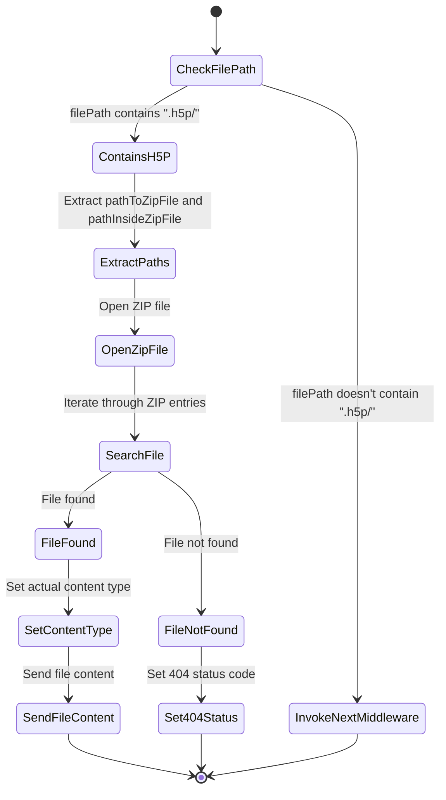

# H5P herunterladen

## Definition:

Das Backend muss in der Lage sein, Dateien aus dem H5P-Format zum Download bereitzustellen.

## Beschreibung
Ein H5P-Element ist eine ZIP-Datei, die eine HTML-Datei, CSS-Dateien, JavaScript-Dateien und Medien-Dateien enthält.
Diese müssen einzeln herunterladbar sein.

## Akzeptanzkriterien:
- Jedes Unterelement eines H5P-Elements kann separat heruntergeladen werden.

## Aktivitätsdiagramm
