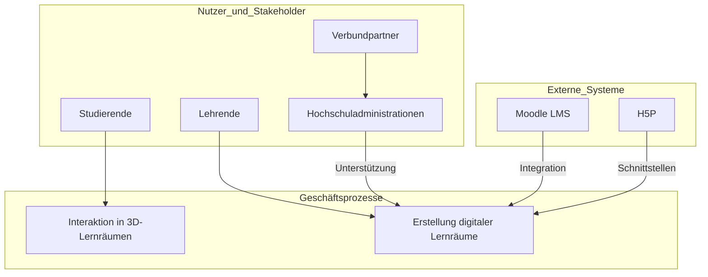

# Systemkontext

### Systemkontext des Projekts AdLer

Der Systemkontext des Projekts AdLer umfasst verschiedene externe Systeme und Schnittstellen, Nutzer und Stakeholder, Geschäftsprozesse und Anwendungsfälle, die technische Umgebung und Infrastruktur, regulatorische und rechtliche Rahmenbedingungen sowie nicht-funktionale Anforderungen.

#### Externe Systeme und Schnittstellen
AdLer soll in bestehende Learning Management Systeme (LMS) wie Moodle integriert werden können. Schnittstellen zu externen Autorentools wie H5P sind ebenfalls vorgesehen.

#### Nutzer und Stakeholder
Die Hauptnutzer sind Studierende, die in den 3D-immersiven digitalen Lernräumen lernen. Lehrende erstellen und konfigurieren diese Lernräume mittels eines Autorentools. Verbundpartner sind die Technische Hochschule Aschaffenburg, die Hochschule Kempten und das Zentrum für Fernstudien im Hochschulverbund. Hochschuladministrationen unterstützen die Implementierung.

#### Geschäftsprozesse und Anwendungsfälle
Lehrende nutzen das Autorentool zur Erstellung digitaler Lernräume und Lernpfade. Studierende interagieren in diesen Räumen und verfolgen individuelle Lernpfade. Es erfolgen fortlaufende Evaluierungen und Anpassungen der Lernräume basierend auf Feedback.

#### Umgebung und Infrastruktur
Die technische Infrastruktur umfasst Serverhardware und Speicherlösungen, die für die Speicherung und Verarbeitung der Daten benötigt werden. 
Auch ist der Code, welcher im Ramend der Entwicklung entstehen soll, open Source und wird auf der Plattform GitHub gehostet.

